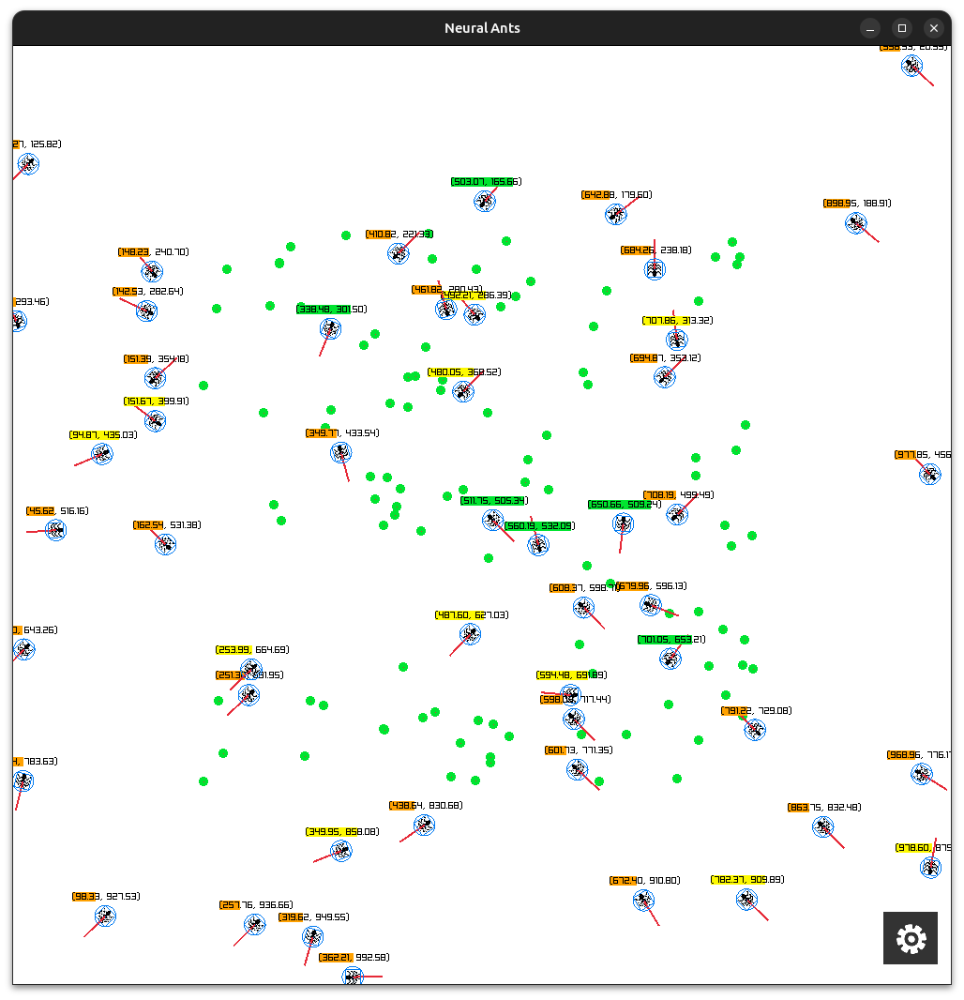

# Neural Ants

A basic neural network simulation featuring artificial ants that learn and evolve using genetic algorithms. Built with C++23 with raylib for visualization and IMGUI for the UI.



## Features

- **Genetic Evolution**: Ants evolve neural networks through natural selection
- **Neural Networks**: Multi-layer perceptrons for intelligent ant behavior
- **Real-time Visualization**: Simple visuals using Raylib graphics

## Requirements

### Supported Platforms

✅ **Tested and Working:**
- Ubuntu 24.04 LTS
- Ubuntu 22.04 LTS  
- Fedora 40
- Fedora 39
- Arch Linux

⚠️ **May require additional setup:**
- Debian 12 (GCC version limitations)

### System Requirements

- **Compiler**: GCC 13+ or Clang 16+ (C++23 support required)
- **CMake**: 3.10 or higher
- **RAM**: 4GB+ recommended for compilation
- **Graphics**: OpenGL 3.3+ compatible GPU

## Installation

### Ubuntu 24.04 / 22.04

```bash
# Install dependencies
sudo apt update
sudo apt install -y \
    gcc-13 g++-13 make cmake git pkg-config \
    libx11-dev libxrandr-dev libxinerama-dev libxcursor-dev libxi-dev \
    libgl1-mesa-dev libglu1-mesa-dev libasound2-dev \
    libxfixes-dev libxrender-dev

# Set GCC 13 as default (if not already)
sudo update-alternatives --install /usr/bin/gcc gcc /usr/bin/gcc-13 100
sudo update-alternatives --install /usr/bin/g++ g++ /usr/bin/g++-13 100

# Clone and build
git clone <repository-url>
cd neural_ants
mkdir build && cd build
cmake ..
make -j$(nproc)
cd ..
./build/neural_ants
```

### Fedora 40 / 39

```bash
# Install dependencies
sudo dnf install -y \
    gcc gcc-c++ make cmake git pkgconfig \
    libX11-devel libXrandr-devel libXinerama-devel libXcursor-devel libXi-devel \
    mesa-libGL-devel mesa-libGLU-devel alsa-lib-devel \
    libXfixes-devel libXrender-devel

# Clone and build
git clone <repository-url>
cd neural_ants
mkdir build && cd build
cmake ..
make -j$(nproc)
cd ..
./build/neural_ants
```

### Arch Linux

```bash
# Install dependencies
sudo pacman -S \
    gcc make cmake git pkgconfig \
    libx11 libxrandr libxinerama libxcursor libxi \
    mesa glu alsa-lib \
    libxfixes libxrender

# Clone and build
git clone <repository-url>
cd neural_ants
mkdir build && cd build
cmake ..
make -j$(nproc)
cd ..
./build/neural_ants
```

## Build Configuration

### Release Build (Default)

```bash
cmake ..
make -j$(nproc)
```

Builds with `-O3 -march=native` optimization for maximum performance.

### Debug Build

```bash
NEURAL_ANTS_DEBUG=1 cmake ..
make -j$(nproc)
```

Builds with debug symbols and no optimization for development.

## Dependencies

These dependencies are automatically downloaded and built via CMake FetchContent:

- **[Intel oneTBB](https://github.com/uxlfoundation/oneTBB)** Threading building blocks
- **[Raylib](https://github.com/raysan5/raylib)** - Graphics and windowing
- **[ImGui](https://github.com/ocornut/imgui)** - Immediate mode GUI
- **[ImPlot](https://github.com/epezent/implot)** - Plotting and visualization
- **[{fmt}](https://github.com/fmtlib/fmt)** - String formatting
- **[Catch2](https://github.com/catchorg/Catch2)** - Testing framework

## Usage

### Running the Simulation

```bash
# From build directory
./neural_ants
```

### Running Tests

```bash
# Unit tests
./neural_ants_unit_tests

# Performance benchmarks
./neural_ants_benchmarks
```

### Controls

- **W/A/S/D/F**: Pan
- **SHIFT**: Rapid Pan
- **Right Mouse + Move Postion**: Pan 
- **ESC**: Exit application

### Development Setup

```bash
# Enable debug build for development
export NEURAL_ANTS_DEBUG=1

# Build with all warnings
cmake .. -DCMAKE_CXX_FLAGS="-Wall -Wextra -Wpedantic"
make -j$(nproc)

# Run tests
./neural_ants_unit_tests
```
## License

This project is licensed under the MIT License - see the [LICENSE](LICENSE) file for details.

### Third-Party Licenses

This project includes or depends on the following third-party libraries:

- **Intel oneTBB** - Apache License 2.0 - Copyright (c) Intel Corporation

For complete third-party license information, see [THIRD-PARTY-LICENSES.md](THIRD-PARTY-LICENSES.md).

## Acknowledgments

- Intel oneTBB team for threading building blocks
- IMGUI for awesome gui
- Raylib community for the fantastic graphics library
- C++ standardization committee for C++23 features
